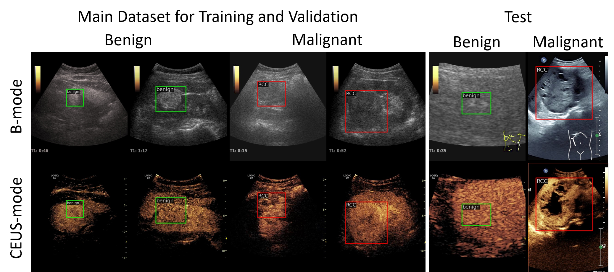

# 

# MUAF-YOLOX: A Multi-modal Ultrasound Video Fusion Network for Renal Tumor Diagnosis

## Introduction

Early diagnosis of renal cancer can greatly improve the survival rate of patients. Contrast-enhanced ultrasound (CEUS) is a cost-effective and non-invasive imaging technique and has become more and more frequently used for renal tumor diagnosis.  However, the classification of benign and malignant renal tumors can still be very challenging due to the highly heterogeneous appearance of cancer and imaging artifacts. Our aim is to detect and classify renal tumors by integrating B-mode and CEUS-mode ultrasound videos. To this end, we propose a novel multi-modal ultrasound video fusion network that can effectively perform multi-modal feature fusion and video classification for renal tumor diagnosis. The attention-based multi-modal fusion module uses cross-attention and self-attention to extract modality-invariant features and modality-specific features in parallel. In addition, we design an object-level temporal aggregation (OTA) module that can automatically filter low-quality features and efficiently integrate temporal information from multiple frames to improve the accuracy of tumor diagnosis. Experimental results on a multicenter dataset show that the proposed framework outperforms the single-modal models and the competing methods. Furthermore, our OTA module achieves higher classification accuracy than the frame-level predictions. 

## Dataset

**Coming soon...**

